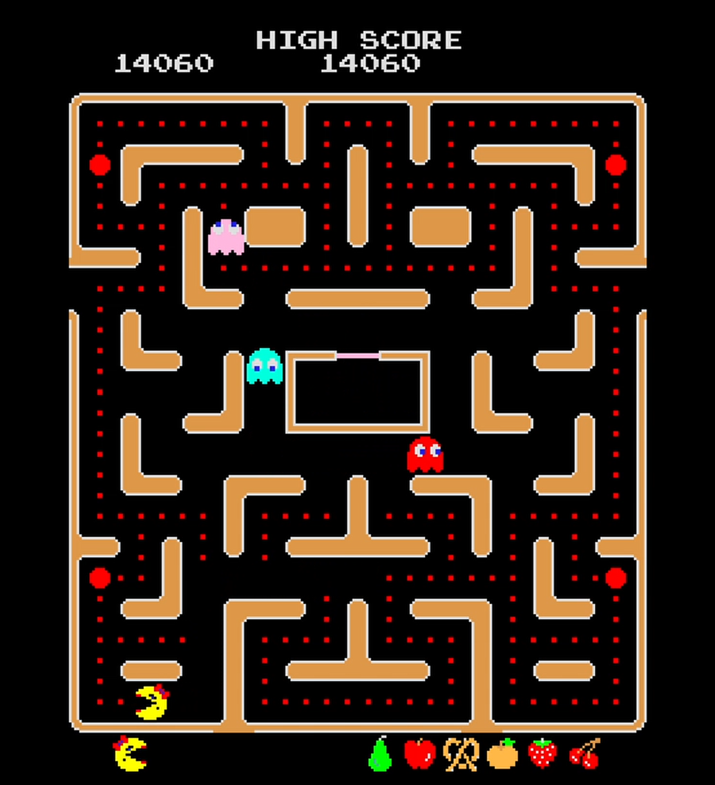

# Internet Arcade
In this article we will play [Ms. Pac-Man through an emulator in the browser](https://archive.org/details/arcade_20pacgal).

## First Ms. Pac-Man Experience 
Strap into the internet time machine to play Ms. Pac-Man 20th Anniversary edition. After ‘inserting’ 12 coins into the arcade by pressing the ‘6’ key on the keyboard and selecting player 1, the game begins. Pressing the arrow keys turns Ms. Pac-Man into one of four directions. With Ms. Pac-Man are ghosts in the maze that hunt her. The goal for the player is to make Ms. Pac-Man collect all coins in the maze. After some levels it becomes apparent that the ghosts do not turn blue randomly. Instead, they turn blue when Ms. Pac-Man eats a large coin. A couple rounds later through accidently running into a ghost that is blue, shows that this resets the ghost to the starting position. Running into a ghost when it is not blue, makes the ghost eat Ms. Pac-Man. As a first time Pac-Man player this happens often. As a result, the three lives Ms. Pac-Man has, vanish quickly. However, when all lives are used up spending a coin allows the player to keep playing after losing all three lives. As a result, the 12 coins ‘inserted’ in the beginning are used up with a high score of 21000 after the second act of the story. In the first act Ms. Pac-Man meets Pac-Man. In the cut scene for the second act Ms. Pac-Man runs after Mac-Man. To find out how the story continues you would need to play yourself.

## Emulator vs. Arcade
With the walkthrough of the experience playing on an emulator in mind, how would it differ to playing on an arcade cabinet? Let’s discuss three aspects: how the input differs, how expectations evolved and the social aspect of an arcade.

When playing through an emulator on a laptop the learning curve for the right timing of the key presses is steep. Without the right timing Ms. Pac-Man often walks straight into a ghost. Especially on a laptop with cramped arrow keys, one can imagine what a difference the dedicated hardware of an arcade would make. Larger buttons or a joystick could go a long way in mastering this game. 

The second difference between an emulator and an arcade are years of innovation. While emulators are impressive, the expectations for a game changed. Today, general purpose laptops can play state of the art games, with realistic graphics, varied gameplay, and immersive stories. On the other hand, arcades are special purpose hardware. During their prime years they could play state of the art games as well. However, the mentioned expectations for a game today are barely satisfied with an arcade. An arcade is more about the competitive aspect, which leads to the social aspect of an arcade.

Lastly, let’s contrast the social aspect of an arcade and an emulator. Here the arcade takes the lead. While emulators are commodity today, arcades used to be an event. You could not simply take them with you and instead would go to a specific place to play an arcade. Maybe you would come with friends. This would be a much more social experience, competing with a friend in Ms. Pac-Man on the same arcade machine, compared to playing on your own through an emulator.

All in all, emulation is impressive technology from a time travel perspective to preserve cultural phenomena. Nevertheless, as the gamer the old games might bring more joy playing how it was meant to play on an arcade machine instead of an emulator. 

* * *

[Home](./)
